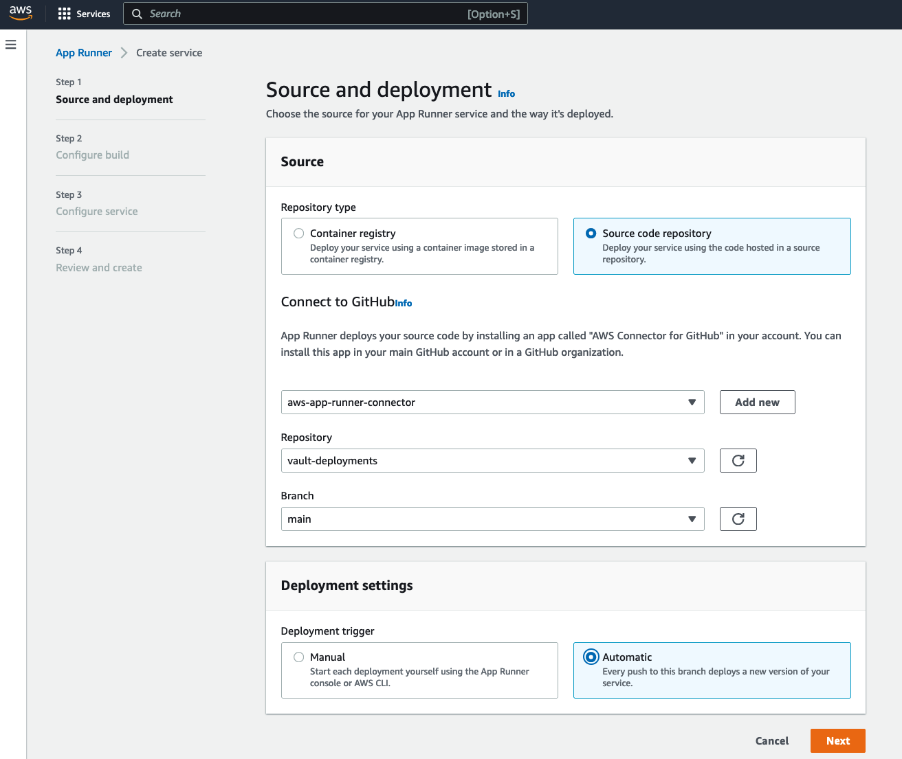
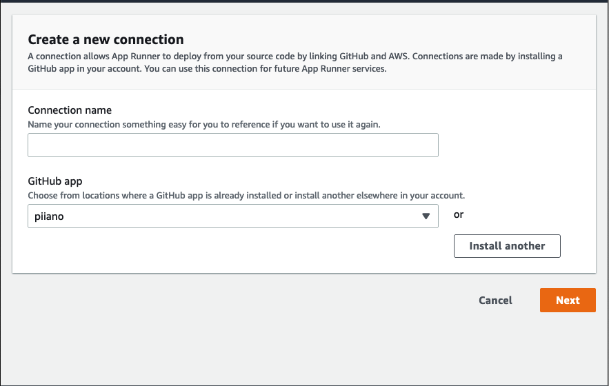
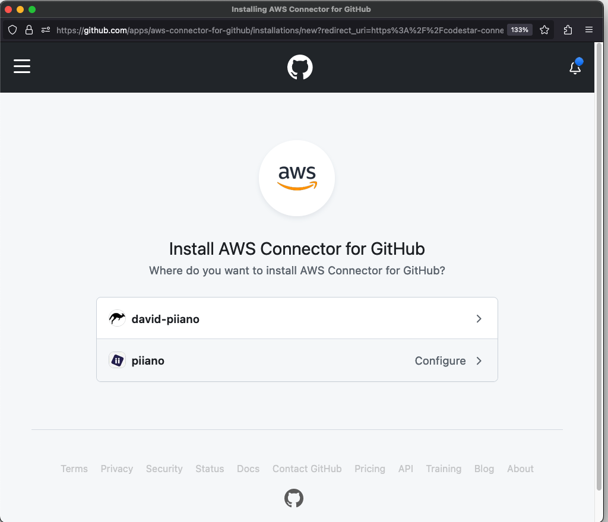
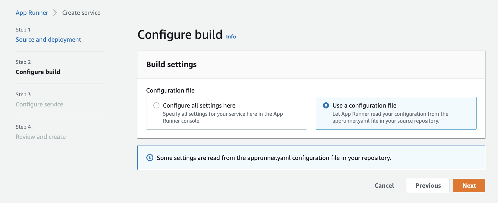
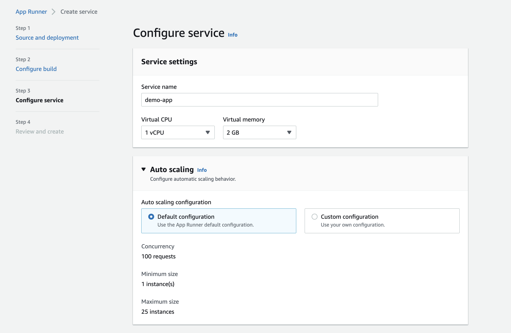
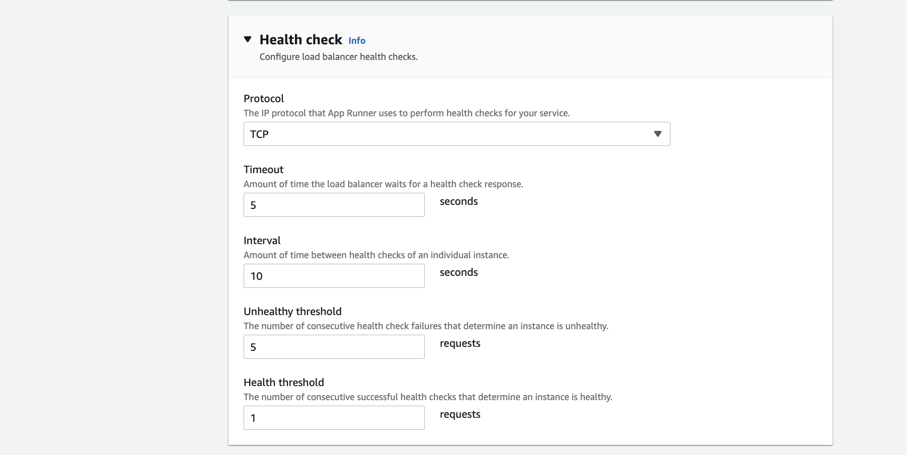
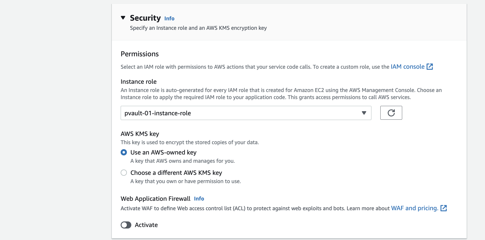
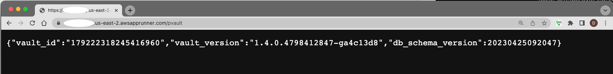

# Demo App for AWS AppRunner

## About

The sample node application has been built on top of AWS AppRunner using typescript and the Vault [typescript-sdk](https://github.com/piiano/vault-typescript/tree/main/sdk/vault-client).

## Installation

### Prerequisites

You must have the [AppRunner](../aws-apprunner) installed already and the details of the application URL and the authentication token available.
This application uses the Vault typescript SDK version 1.0.8.

## Steps

1. Clone this repository
1. Move this directory into a new repository of its own. Let's call it `demo-app` under your account `myaccount`. It is assumed that the repository will be hosted in: `https://github.com/myaccount/demo-app`
1. Modify [apprunner.yaml](apprunner.yaml):
   1. Change `PVAULT_URL` containing generic xxxx. to the right URL of the Vault
   1. Change `PVAULT_API_KEY` account number from the generic `123456789012` into your account number
1. Open the AWS Console in the AppRunner section: https://us-east-2.console.aws.amazon.com/apprunner
1. Click "Create service" and follow these steps.

   1. Choose Source code repository

      

   1. Connect to Github and replace repository name with your own repository

      

   1. Instead of Piiano, you should have your own application (click Install) and it will pop up a connection to GitHub. Select your organization or yourself

      

   1. Select automatic mode as the `Deployment settings`

1. Select to use a [configuration file](apprunner.yaml) in the `build settings`.

   

1. Settings for step 3: `Configure service`.  
   Don't forget to **set the same VPC as the Vault** in the networking section.

   

1. Setting for step 3: `Health check`

   

1. Setting for step 3: `Security`

   

1. Deploy!

## Usage

Once deployed this application exposes port 3000 on the AppRunner URL for calls from the internet.

The demo application connects to the Vault (which is also running in AppRunner) and retrieves the status and version. Note that the version requires correct authentication configuration. If it ran successfully, it means all is configured well.

Example:

```
> curl https://<your magic prefix>.us-east-2.awsapprunner.com:3000
Welcome to the demo app

> curl https://<your magic prefix>.us-east-2.awsapprunner.com:3000/pvault
{"vault_id":"179222318245416960","vault_version":"1.4.0.4798412847-ga4c13d8","db_schema_version":20230425092047}
```

Similarly, it works directly from a web browser:

