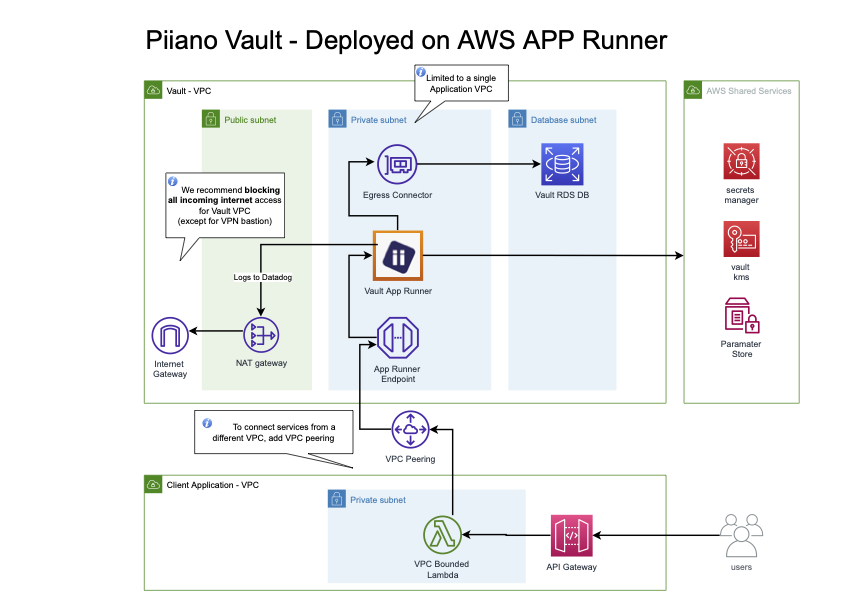

# Terraform for Piiano Vault AWS Elastic Container Service - ECS

This module deploys Piiano Vault on a given AWS region. It will outputs the private Vault URL post deployment.

This application version is 1.0.17 and is compatible with Vault version 1.11.4 .

## Solution Architecture

Vault is deployed as a single ECS cluster/container regional service. The service is deployed in the ECS VPC and is configured for private access only from the `pvault-vpc`.
Internally, Vault communicates with a Postgres RDS that resides in the database subnet.

<!--  -->

## Installed Components

The following components are installed by default (some are optional):

| Name                      | Description                                    | Remarks                                                     |
| ------------------------- | ---------------------------------------------- | ----------------------------------------------------------- |
| VPC                       | 3 subnets \* 2 Availability zone               | Optional - Can be replaced with existing VPC parameters     |
| Bastion                   | bastion EC2 instance                           | Optional - For testing purpose. Created in the `pvault-vpc` |
| RDS                       | AWS Managed Postgres instance                  |                                                             |
| Secrets                   | AWS Secret manager                             |                                                             |
| Parameters                | AWS parameter store                            |                                                             |  |
| ECS Cluster               | ECS Fargate deployment of Piiano Vault         |                                                             |
| Application Load Balancer | AWS ALB connected to back Piiano Vault Service |                                                             |
| ECS Autoscaler            | AWS CPU based Autoscaler                       | Optional                                                    |

## Use cases

The terraform parameters can be overridden by updating the .tfvars file or by configuring an equivalent environment variable: `export TF_VAR_<variable name>=<new value>`.

1. With the default parameters - create a new VPC without a bastion for testing. To install the bastion, change the `create_bastion` variable to `true`.
2. To reuse your existing VPC, disable the creation by setting `create_vpc` to `false` and configure the parameter for `vpc_id`. You can find your VPC ID in the AWS console. It is also required to configure your existing subnets with these variables: `private_subnet_ids`, `database_subnet_ids`, `allowed_cidr_blocks`.

## Prerequisites

1. A valid license - Click register to [obtain your license](https://piiano.com/docs/guides/get-started). Update it in .tfvars file or configure the environment variable `export TF_VAR_pvault_service_license=<the license>`
2. AWS administrative role for the target account.

## Usage

### Module


```hcl
module "pvault" {
  source                 = "github.com/piiano/vault-deployments//aws-ecs"
  pvault_service_license = "eyJhbGc..."
}
```

### Standalone project

If you want to use the provided Terraform module directly, please follow these steps:

1. Clone the repository - `git clone git@github.com:piiano/vault-deployments.git`
2. Uncomment the `provider "aws"` block in `02-provider.tf` file.
3. Change directory to the ECS module directory - `cd aws-ecs`
4. Run the following commands:

### Installation

```sh
terraform init
terraform apply
```

### Post installation

When a successful installation completes, it shows the following output:

```sh
authtoken = "Secret Manager: /pvault/pvault_service_admin_api_key --> retrieve value"
vault_url = "https://<random dns>.<region>.elb.amazonaws.com"
```

To check that the Vault is working as expected run the following from inside the application VPC. Optionally, the deployment script can deploy a bastion machine for this purpose:

```sh
alias pvault="docker run --rm -i -v $(pwd):/pwd -w /pwd piiano/pvault-cli:1.11.4"
pvault --addr <VAULT URL from above> --authtoken '<token from the secret manager>' selftest basic
```

<!-- BEGIN_TF_DOCS -->
## Requirements

| Name | Version |
|------|---------|
| <a name="requirement_terraform"></a> [terraform](#requirement\_terraform) | ~> 1.3.0 |
| <a name="requirement_aws"></a> [aws](#requirement\_aws) | >= 5.0.0 |

## Providers

| Name | Version |
|------|---------|
| <a name="provider_aws"></a> [aws](#provider\_aws) | 4.65.0 |
| <a name="provider_random"></a> [random](#provider\_random) | 3.5.1 |

## Modules

| Name | Source | Version |
|------|--------|---------|
| <a name="module_db"></a> [db](#module\_db) | terraform-aws-modules/rds/aws | 5.2.3 |
| <a name="module_ecs"></a> [ecs](#module\_ecs) | terraform-aws-modules/ecs/aws | 4.1.3 |
| <a name="module_vpc"></a> [vpc](#module\_vpc) | terraform-aws-modules/vpc/aws | 5.0.0 |

## Resources

| Name | Type |
|------|------|
| [aws_alb.pvault](https://registry.terraform.io/providers/hashicorp/aws/latest/docs/resources/alb) | resource |
| [aws_appautoscaling_policy.ecs_average_cpu_50](https://registry.terraform.io/providers/hashicorp/aws/latest/docs/resources/appautoscaling_policy) | resource |
| [aws_appautoscaling_target.pvault_target](https://registry.terraform.io/providers/hashicorp/aws/latest/docs/resources/appautoscaling_target) | resource |
| [aws_cloudwatch_log_group.pvault](https://registry.terraform.io/providers/hashicorp/aws/latest/docs/resources/cloudwatch_log_group) | resource |
| [aws_ecs_service.pvault](https://registry.terraform.io/providers/hashicorp/aws/latest/docs/resources/ecs_service) | resource |
| [aws_ecs_task_definition.pvault](https://registry.terraform.io/providers/hashicorp/aws/latest/docs/resources/ecs_task_definition) | resource |
| [aws_iam_instance_profile.bastion](https://registry.terraform.io/providers/hashicorp/aws/latest/docs/resources/iam_instance_profile) | resource |
| [aws_iam_role.bastion](https://registry.terraform.io/providers/hashicorp/aws/latest/docs/resources/iam_role) | resource |
| [aws_iam_role.pvault_ecs](https://registry.terraform.io/providers/hashicorp/aws/latest/docs/resources/iam_role) | resource |
| [aws_iam_role_policy_attachment.bastion](https://registry.terraform.io/providers/hashicorp/aws/latest/docs/resources/iam_role_policy_attachment) | resource |
| [aws_instance.bastion](https://registry.terraform.io/providers/hashicorp/aws/latest/docs/resources/instance) | resource |
| [aws_kms_key.pvault](https://registry.terraform.io/providers/hashicorp/aws/latest/docs/resources/kms_key) | resource |
| [aws_lb_listener.pvault](https://registry.terraform.io/providers/hashicorp/aws/latest/docs/resources/lb_listener) | resource |
| [aws_lb_target_group.pvault](https://registry.terraform.io/providers/hashicorp/aws/latest/docs/resources/lb_target_group) | resource |
| [aws_secretsmanager_secret.db_password](https://registry.terraform.io/providers/hashicorp/aws/latest/docs/resources/secretsmanager_secret) | resource |
| [aws_secretsmanager_secret.pvault_service_admin_api_key](https://registry.terraform.io/providers/hashicorp/aws/latest/docs/resources/secretsmanager_secret) | resource |
| [aws_secretsmanager_secret.pvault_service_license](https://registry.terraform.io/providers/hashicorp/aws/latest/docs/resources/secretsmanager_secret) | resource |
| [aws_secretsmanager_secret_version.db_password](https://registry.terraform.io/providers/hashicorp/aws/latest/docs/resources/secretsmanager_secret_version) | resource |
| [aws_secretsmanager_secret_version.pvault_service_admin_api_key](https://registry.terraform.io/providers/hashicorp/aws/latest/docs/resources/secretsmanager_secret_version) | resource |
| [aws_secretsmanager_secret_version.pvault_service_license](https://registry.terraform.io/providers/hashicorp/aws/latest/docs/resources/secretsmanager_secret_version) | resource |
| [aws_security_group.alb](https://registry.terraform.io/providers/hashicorp/aws/latest/docs/resources/security_group) | resource |
| [aws_security_group.bastion](https://registry.terraform.io/providers/hashicorp/aws/latest/docs/resources/security_group) | resource |
| [aws_security_group.rds](https://registry.terraform.io/providers/hashicorp/aws/latest/docs/resources/security_group) | resource |
| [aws_security_group.service](https://registry.terraform.io/providers/hashicorp/aws/latest/docs/resources/security_group) | resource |
| [random_password.pvault_service_admin_api_key](https://registry.terraform.io/providers/hashicorp/random/latest/docs/resources/password) | resource |
| [aws_ami.amazon_linux_2](https://registry.terraform.io/providers/hashicorp/aws/latest/docs/data-sources/ami) | data source |
| [aws_arn.db_password](https://registry.terraform.io/providers/hashicorp/aws/latest/docs/data-sources/arn) | data source |
| [aws_availability_zones.available](https://registry.terraform.io/providers/hashicorp/aws/latest/docs/data-sources/availability_zones) | data source |

## Inputs

| Name | Description | Type | Default | Required |
|------|-------------|------|---------|:--------:|
| <a name="input_allowed_cidr_blocks"></a> [allowed\_cidr\_blocks](#input\_allowed\_cidr\_blocks) | The subnets CIDRs which allowed to access the Pvault service | `list(string)` | `[]` | no |
| <a name="input_aws_region"></a> [aws\_region](#input\_aws\_region) | AWS region to deploy vault | `string` | `"us-east-2"` | no |
| <a name="input_create_bastion"></a> [create\_bastion](#input\_create\_bastion) | Controls if a new EC2 bastion should be created in VPC | `bool` | `false` | no |
| <a name="input_create_ecs_cluster"></a> [create\_ecs\_cluster](#input\_create\_ecs\_cluster) | Controls if a new AWS ECS Cluster should be created | `bool` | `true` | no |
| <a name="input_create_pvault_autoscaler"></a> [create\_pvault\_autoscaler](#input\_create\_pvault\_autoscaler) | Controls if a service auto scaler should be created | `bool` | `true` | no |
| <a name="input_create_vpc"></a> [create\_vpc](#input\_create\_vpc) | Controls if VPC should be created (it affects almost all resources) | `bool` | `true` | no |
| <a name="input_database_subnet_group_name"></a> [database\_subnet\_group\_name](#input\_database\_subnet\_group\_name) | This parameter specifies the name of the subnet group to deploy the database | `string` | `""` | no |
| <a name="input_database_subnet_ids"></a> [database\_subnet\_ids](#input\_database\_subnet\_ids) | The IDs if the Database subnets where the RDS will deploy | `list(string)` | `[]` | no |
| <a name="input_deployment_id"></a> [deployment\_id](#input\_deployment\_id) | The unique deployment id of this deployment | `string` | `"pvault"` | no |
| <a name="input_private_subnet_ids"></a> [private\_subnet\_ids](#input\_private\_subnet\_ids) | The IDs of the private subnets where the Pvault service will deploy | `list(string)` | `[]` | no |
| <a name="input_pvault_admin_may_read_data"></a> [pvault\_admin\_may\_read\_data](#input\_pvault\_admin\_may\_read\_data) | Whether Admin is allowed to read data. See https://piiano.com/docs/guides/configure/environment-variables#service-and-features for more details. | `bool` | `false` | no |
| <a name="input_pvault_devmode"></a> [pvault\_devmode](#input\_pvault\_devmode) | Enable devmode for Pvault. See https://piiano.com/docs/guides/configure/environment-variables#production-and-development-mode for more details. | `bool` | `false` | no |
| <a name="input_pvault_env_vars"></a> [pvault\_env\_vars](#input\_pvault\_env\_vars) | A map of environment variables to set for the Pvault service. See https://piiano.com/docs/guides/configure/environment-variables for more details. | `map(string)` | `{}` | no |
| <a name="input_pvault_log_customer_env"></a> [pvault\_log\_customer\_env](#input\_pvault\_log\_customer\_env) | Identifies the environment in all the observability platforms. Recommended values are PRODUCTION, STAGING, and DEV | `string` | n/a | yes |
| <a name="input_pvault_log_customer_identifier"></a> [pvault\_log\_customer\_identifier](#input\_pvault\_log\_customer\_identifier) | Identifies the customer in all the observability platforms | `string` | n/a | yes |
| <a name="input_pvault_port"></a> [pvault\_port](#input\_pvault\_port) | Pvault application port number | `string` | `"8123"` | no |
| <a name="input_pvault_repository"></a> [pvault\_repository](#input\_pvault\_repository) | Pvault repository public image | `string` | `"piiano/pvault-server"` | no |
| <a name="input_pvault_service_license"></a> [pvault\_service\_license](#input\_pvault\_service\_license) | Pvault license code https://piiano.com/docs/guides/install/pre-built-docker-containers | `string` | n/a | yes |
| <a name="input_pvault_tag"></a> [pvault\_tag](#input\_pvault\_tag) | n/a | `string` | `"1.7.0"` | no |
| <a name="input_rds_allocated_storage"></a> [rds\_allocated\_storage](#input\_rds\_allocated\_storage) | Pvault RDS initial allocated storage in GB | `number` | `"20"` | no |
| <a name="input_rds_backup_retention_period"></a> [rds\_backup\_retention\_period](#input\_rds\_backup\_retention\_period) | The days to retain backups for the RDS | `number` | `30` | no |
| <a name="input_rds_db_name"></a> [rds\_db\_name](#input\_rds\_db\_name) | Pvault RDS database name | `string` | `"pvault"` | no |
| <a name="input_rds_instance_class"></a> [rds\_instance\_class](#input\_rds\_instance\_class) | Pvault RDS instance class | `string` | `"db.t4g.medium"` | no |
| <a name="input_rds_port"></a> [rds\_port](#input\_rds\_port) | Pvault RDS port | `string` | `"5432"` | no |
| <a name="input_rds_username"></a> [rds\_username](#input\_rds\_username) | Pvault RDS username | `string` | `"pvault"` | no |
| <a name="input_vpc_id"></a> [vpc\_id](#input\_vpc\_id) | The existing VPC\_ID in case that `create_vpc` is false | `string` | `""` | no |

## Outputs

| Name | Description |
|------|-------------|
| <a name="output_authtoken"></a> [authtoken](#output\_authtoken) | n/a |
| <a name="output_bastion_instance_id"></a> [bastion\_instance\_id](#output\_bastion\_instance\_id) | n/a |
| <a name="output_vault_url"></a> [vault\_url](#output\_vault\_url) | n/a |
<!-- END_TF_DOCS -->
