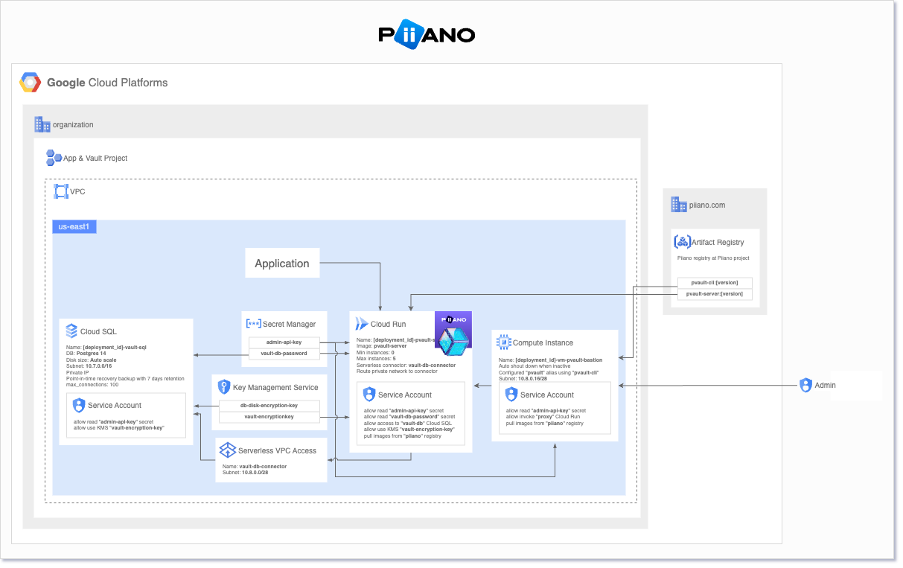
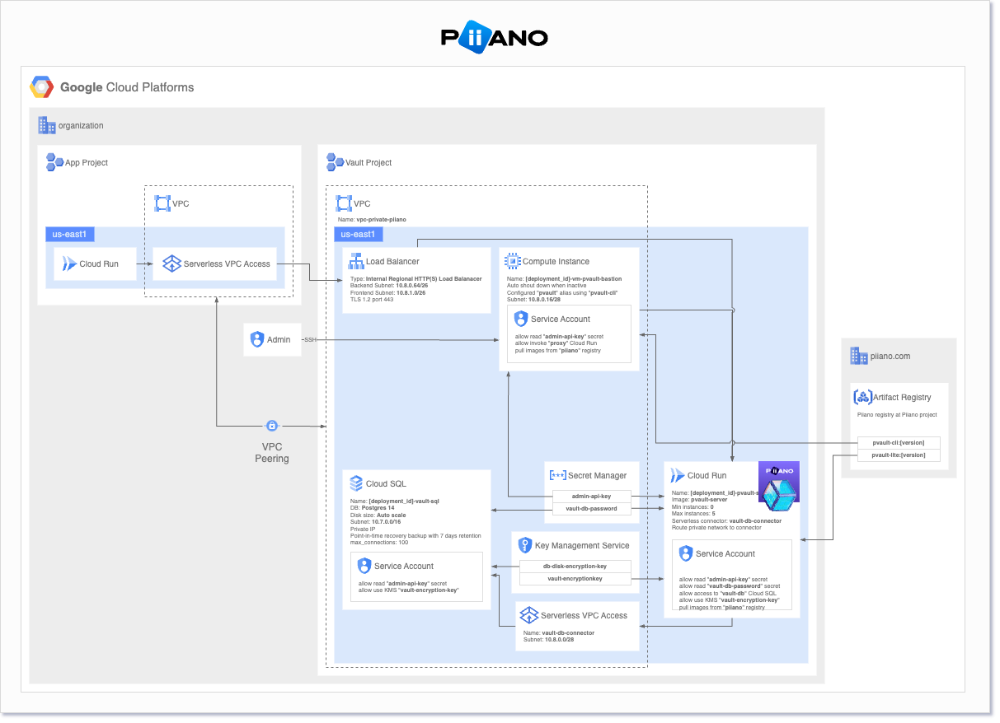
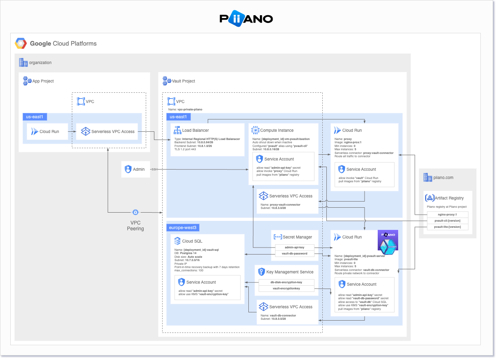

# Terraform for Piiano Vault GCP Cloud Run

This module deploys Piiano Vault on a given GCP region. It will output the private Vault URL post deployment.

This application version is 1.0.14 and is compatible with Vault version 1.11.1 .

## Solution Architecture

Vault is deployed as a single Cloud Run regional service. The service is deployed in the Cloud Run VPC (network) and is configured for private access only from the network named by default `<deployment-id>-vpc-private-piiano`.
Internally, Vault communicates with a CloudSQL that resides in the database subnet.



When var create_proxy is true, a proxy and an internal load balancer are deployed in the VPC. The proxy is configured to route traffic to the Vault service.




Vault and its backing store DB can be deployed in multiple zones. The following diagram shows a multi-zone deployment with a proxy and an internal load balancer.



## Installed Components

The following components are installed by default (some are optional):

| Name           | Description                                  | Comments                                                                                                                                                         |
| -------------- | -------------------------------------------- | ---------------------------------------------------------------------------------------------------------------------------------------------------------------- |
| GAR            | Artifact Registry                            | For hosting the Vault's docker images                                                                                                                            |
| KMS            | Key Management Service                       | Holds Vault's key encryption key (KEK)                                                                                                                           |
| VPC/Network    | Private Network for the Vault                | Created with its own dedicated subnet                                                                                                                            |
| Bastion        | bastion Virtual Machine instance             | Optional - For testing. Created in the network of the Vault                                                                                                      |
| CloudSQL       | GCP Managed Postgres instance                | The application database. Default is f1-micro, use for your own considerations                                                                                   |
| Cloud Run      | Managed Cloud Run deployment of Piiano Vault |                                                                                                                                                                  |
| Secret Manager | Secret Manager                               | Holds the Vault's admin API key                                                                                                                                  |
| Internal LB    | Internal Load Balancer                       | [Create private key and certificate](https://cloud.google.com/load-balancing/docs/ssl-certificates/self-managed-certs) and store in private_key.pem and cert.pem |

## Use cases

The terraform parameters can be overridden by updating the .tfvars file or by configuring an equivalent environment variable: `export TF_VAR_<variable name>=<new value>`.

## Prerequisites

1. A valid license - Click register to [obtain your license](https://piiano.com/docs/guides/get-started). Update it in .tfvars file or configure the environment variable `export TF_VAR_pvault_service_license=<the license>`
2. GCP administrative role for the target project.

## Usage

```hcl
module "pvault" {
  source                    = "github.com/piiano/vault-deployments//gcp-cloud-run"
  pvault_service_license = "eyJhbGc..."
}
```

### Installation

Mandatory Terraform variables include:
* `project_id` - the GCP project id to install the Vault on.
* `deployment_id` - an informative string to name this deployment. You can install multiple deployment on the same region.
* `client_region` - the GCP region to install the Cloud Run on.
* `pvault_service_license` - a valid license
* `pvault_log_customer_identifier` - your name as a customer to identify your logs when requesting support from Piiano.
* `pvault_log_customer_env` - your environment type, e.g. production,staging,dev or ci

`cloudresourcemanager.googleapis.com` API service must be enabled. Enable it from the [Cloud Resources Manager](https://console.cloud.google.com/apis/api/cloudresourcemanager.googleapis.com/metrics).

```bash
gcloud auth application-default login
terraform init
terraform apply
```
Terraform will print a deployment plan and prompt for an approval.
Review the plan and if all resources are approves. enter `yes` to apply the changes.


### Post installation

When a successful installation completes, it shows the following output:

```sh
authtoken = "Secret Manager: `deployment id`/admin_api_key --> retrieve value"
vault_url = "https://`deployment id`-pvault-server-<random chars>-uc.a.run.app"
```

To check that the Vault is working as expected run the following from inside the application VPC. Optionally, the deployment script can deploy a bastion machine for this purpose:

```sh
alias pvault="docker run --rm -i -v $(pwd):/pwd -w /pwd piiano/pvault-cli:1.11.1"
pvault --addr <VAULT URL from above> --authtoken '<token from the secret manager>' selftest basic
```

:information_source: Note that the Virtual Machine will suspend itself after a period of inactivity. You can resume it from the Cloud Console or command line.

<!-- BEGIN_TF_DOCS -->
## Requirements

| Name | Version |
|------|---------|
| <a name="requirement_google"></a> [google](#requirement\_google) | >= 4.73.0 |
| <a name="requirement_google-beta"></a> [google-beta](#requirement\_google-beta) | >= 4.73.0 |

## Providers

| Name | Version |
|------|---------|
| <a name="provider_google"></a> [google](#provider\_google) | >= 4.73.0 |
| <a name="provider_google-beta"></a> [google-beta](#provider\_google-beta) | >= 4.73.0 |
| <a name="provider_random"></a> [random](#provider\_random) | n/a |

## Modules

| Name | Source | Version |
|------|--------|---------|
| <a name="module_postgresql-db"></a> [postgresql-db](#module\_postgresql-db) | GoogleCloudPlatform/sql-db/google//modules/postgresql | 15.0.0 |
| <a name="module_proxy_internal_load_balancer"></a> [proxy\_internal\_load\_balancer](#module\_proxy\_internal\_load\_balancer) | ./internal-load-balancer | n/a |
| <a name="module_vpc"></a> [vpc](#module\_vpc) | terraform-google-modules/network/google | ~> 4.0 |

## Resources

| Name | Type |
|------|------|
| [google-beta_google_cloud_run_service.nginx_proxy](https://registry.terraform.io/providers/hashicorp/google-beta/latest/docs/resources/google_cloud_run_service) | resource |
| [google-beta_google_cloud_run_service.pvault-server](https://registry.terraform.io/providers/hashicorp/google-beta/latest/docs/resources/google_cloud_run_service) | resource |
| [google-beta_google_compute_global_address.private_ip_address](https://registry.terraform.io/providers/hashicorp/google-beta/latest/docs/resources/google_compute_global_address) | resource |
| [google-beta_google_project_service.vpcaccess_api](https://registry.terraform.io/providers/hashicorp/google-beta/latest/docs/resources/google_project_service) | resource |
| [google-beta_google_project_service_identity.gcp_sa_cloud_sql](https://registry.terraform.io/providers/hashicorp/google-beta/latest/docs/resources/google_project_service_identity) | resource |
| [google-beta_google_service_networking_connection.private_vpc_connection](https://registry.terraform.io/providers/hashicorp/google-beta/latest/docs/resources/google_service_networking_connection) | resource |
| [google-beta_google_vpc_access_connector.connector_vault_cloud_run](https://registry.terraform.io/providers/hashicorp/google-beta/latest/docs/resources/google_vpc_access_connector) | resource |
| [google-beta_google_vpc_access_connector.proxy_vault_connector](https://registry.terraform.io/providers/hashicorp/google-beta/latest/docs/resources/google_vpc_access_connector) | resource |
| [google_cloud_run_service_iam_policy.noauth](https://registry.terraform.io/providers/hashicorp/google/latest/docs/resources/cloud_run_service_iam_policy) | resource |
| [google_cloud_run_service_iam_policy.proxy_noauth](https://registry.terraform.io/providers/hashicorp/google/latest/docs/resources/cloud_run_service_iam_policy) | resource |
| [google_compute_instance.pvault-bastion](https://registry.terraform.io/providers/hashicorp/google/latest/docs/resources/compute_instance) | resource |
| [google_kms_crypto_key.db-encryption-key](https://registry.terraform.io/providers/hashicorp/google/latest/docs/resources/kms_crypto_key) | resource |
| [google_kms_crypto_key.vault-encryption-key](https://registry.terraform.io/providers/hashicorp/google/latest/docs/resources/kms_crypto_key) | resource |
| [google_kms_crypto_key_iam_member.crypto_key_cloud_run](https://registry.terraform.io/providers/hashicorp/google/latest/docs/resources/kms_crypto_key_iam_member) | resource |
| [google_kms_crypto_key_iam_member.crypto_key_db](https://registry.terraform.io/providers/hashicorp/google/latest/docs/resources/kms_crypto_key_iam_member) | resource |
| [google_kms_key_ring.db_keyring](https://registry.terraform.io/providers/hashicorp/google/latest/docs/resources/kms_key_ring) | resource |
| [google_kms_key_ring.vault_keyring](https://registry.terraform.io/providers/hashicorp/google/latest/docs/resources/kms_key_ring) | resource |
| [google_project_iam_member.pvault_sql_client](https://registry.terraform.io/providers/hashicorp/google/latest/docs/resources/project_iam_member) | resource |
| [google_project_iam_member.vault_client](https://registry.terraform.io/providers/hashicorp/google/latest/docs/resources/project_iam_member) | resource |
| [google_project_service.apis](https://registry.terraform.io/providers/hashicorp/google/latest/docs/resources/project_service) | resource |
| [google_secret_manager_secret.admin_api_key](https://registry.terraform.io/providers/hashicorp/google/latest/docs/resources/secret_manager_secret) | resource |
| [google_secret_manager_secret.db_password_secret](https://registry.terraform.io/providers/hashicorp/google/latest/docs/resources/secret_manager_secret) | resource |
| [google_secret_manager_secret_iam_member.bastion_vm_admin_api_key_secret_access](https://registry.terraform.io/providers/hashicorp/google/latest/docs/resources/secret_manager_secret_iam_member) | resource |
| [google_secret_manager_secret_iam_member.cloud_run_admin_api_key_secret_access](https://registry.terraform.io/providers/hashicorp/google/latest/docs/resources/secret_manager_secret_iam_member) | resource |
| [google_secret_manager_secret_iam_member.cloud_run_secrets_access](https://registry.terraform.io/providers/hashicorp/google/latest/docs/resources/secret_manager_secret_iam_member) | resource |
| [google_secret_manager_secret_version.admin_api_key_version](https://registry.terraform.io/providers/hashicorp/google/latest/docs/resources/secret_manager_secret_version) | resource |
| [google_secret_manager_secret_version.db_password_secret_version](https://registry.terraform.io/providers/hashicorp/google/latest/docs/resources/secret_manager_secret_version) | resource |
| [google_service_account.proxy_sa](https://registry.terraform.io/providers/hashicorp/google/latest/docs/resources/service_account) | resource |
| [google_service_account.pvault-bastion-sa](https://registry.terraform.io/providers/hashicorp/google/latest/docs/resources/service_account) | resource |
| [google_service_account.pvault-server-sa](https://registry.terraform.io/providers/hashicorp/google/latest/docs/resources/service_account) | resource |
| [random_password.admin_api_key](https://registry.terraform.io/providers/hashicorp/random/latest/docs/resources/password) | resource |
| [google_iam_policy.noauth](https://registry.terraform.io/providers/hashicorp/google/latest/docs/data-sources/iam_policy) | data source |

## Inputs

| Name | Description | Type | Default | Required |
|------|-------------|------|---------|:--------:|
| <a name="input_apis_disable_on_destroy"></a> [apis\_disable\_on\_destroy](#input\_apis\_disable\_on\_destroy) | Disable APIs on destroy | `bool` | `false` | no |
| <a name="input_bastion_subnet_name"></a> [bastion\_subnet\_name](#input\_bastion\_subnet\_name) | Bastion subnet name in the vpc in case that `create_vpc` is false | `string` | `null` | no |
| <a name="input_client_region"></a> [client\_region](#input\_client\_region) | Client region for cloud load balancer. Applicable when create\_proxy = true. if empty fallback to default region | `string` | `null` | no |
| <a name="input_cloudsql_deletion_protection"></a> [cloudsql\_deletion\_protection](#input\_cloudsql\_deletion\_protection) | Cloud sql instance deletion protection | `bool` | `false` | no |
| <a name="input_cloudsql_instance_ip_range"></a> [cloudsql\_instance\_ip\_range](#input\_cloudsql\_instance\_ip\_range) | Cloud sql instance IP range | `string` | `"10.7.0.0/16"` | no |
| <a name="input_cloudsql_name"></a> [cloudsql\_name](#input\_cloudsql\_name) | Vault cloud sql name | `string` | `"pvault"` | no |
| <a name="input_cloudsql_region"></a> [cloudsql\_region](#input\_cloudsql\_region) | Vault cloud sql region. if empty fallback to default region | `string` | `null` | no |
| <a name="input_cloudsql_tier"></a> [cloudsql\_tier](#input\_cloudsql\_tier) | Cloud sql instance tier | `string` | `"db-f1-micro"` | no |
| <a name="input_cloudsql_username"></a> [cloudsql\_username](#input\_cloudsql\_username) | Vault cloud sql user name | `string` | `"pvault"` | no |
| <a name="input_cloudsql_zone"></a> [cloudsql\_zone](#input\_cloudsql\_zone) | Vault cloud sql zone. if empty fallback to default zone | `string` | `null` | no |
| <a name="input_connector_cloud_run_max_instances"></a> [connector\_cloud\_run\_max\_instances](#input\_connector\_cloud\_run\_max\_instances) | Maximum number of instances used by VPC Serverless connector | `number` | `4` | no |
| <a name="input_create_bastion"></a> [create\_bastion](#input\_create\_bastion) | Controls if bastion resources should be created | `bool` | `true` | no |
| <a name="input_create_ilb"></a> [create\_ilb](#input\_create\_ilb) | Controls if Cloud Internal Load Balancer resources should be created. See readme for more details on deployment modes [https://github.com/piiano/vault-deployments/blob/main/gcp-cloud-run/README.md#solution-architecture](https://github.com/piiano/vault-deployments/blob/main/gcp-cloud-run/README.md#solution-architecture) for more details. | `bool` | `false` | no |
| <a name="input_create_proxy"></a> [create\_proxy](#input\_create\_proxy) | Controls if proxy resources should be created. See README for more details on deployment modes [https://github.com/piiano/vault-deployments/blob/main/gcp-cloud-run/README.md#solution-architecture](https://github.com/piiano/vault-deployments/blob/main/gcp-cloud-run/README.md#solution-architecture) | `bool` | `false` | no |
| <a name="input_create_vpc"></a> [create\_vpc](#input\_create\_vpc) | Controls if VPC should be created (it affects almost all resources) | `bool` | `true` | no |
| <a name="input_default_region"></a> [default\_region](#input\_default\_region) | Default region where resources without a specified region will be deployed | `string` | `"us-central1"` | no |
| <a name="input_default_zone"></a> [default\_zone](#input\_default\_zone) | Default zone where resources without a specified zone will be deployed | `string` | `"us-central1-a"` | no |
| <a name="input_deployment_id"></a> [deployment\_id](#input\_deployment\_id) | The unique deployment id of this deployment | `string` | n/a | yes |
| <a name="input_env"></a> [env](#input\_env) | Deployment environment | `string` | `"dev"` | no |
| <a name="input_firewall"></a> [firewall](#input\_firewall) | List of firewalls to be created when `create_vpc` is true | `any` | <pre>[<br>  {<br>    "allow": [<br>      {<br>        "ports": [<br>          "22"<br>        ],<br>        "protocol": "tcp"<br>      }<br>    ],<br>    "direction": "INGRESS",<br>    "name": "fw-allow-ssh-ingress-vpc-private-piiano",<br>    "ranges": [<br>      "0.0.0.0/0"<br>    ]<br>  }<br>]</pre> | no |
| <a name="input_ilb_backend_range"></a> [ilb\_backend\_range](#input\_ilb\_backend\_range) | Backend range for cloud load balancer. Applicable when create\_proxy = true. /26 CIDR range | `string` | `"10.8.0.64/26"` | no |
| <a name="input_ilb_frontend_range"></a> [ilb\_frontend\_range](#input\_ilb\_frontend\_range) | Frontend range for cloud load balancer. Applicable when create\_proxy = true. /26 CIDR range | `string` | `"10.8.1.0/26"` | no |
| <a name="input_project"></a> [project](#input\_project) | GCP Project ID where resources will be deployed | `string` | n/a | yes |
| <a name="input_proxy_image"></a> [proxy\_image](#input\_proxy\_image) | Proxy Docker image | `string` | `"us-central1-docker.pkg.dev/piiano/docker/nginx-proxy:3"` | no |
| <a name="input_proxy_vault_serverless_connector_range"></a> [proxy\_vault\_serverless\_connector\_range](#input\_proxy\_vault\_serverless\_connector\_range) | Cloud Run connector /28 CIDR range (used to connect Cloud Run to VPC) | `string` | `"10.8.3.0/28"` | no |
| <a name="input_pvault_bastion_subnet"></a> [pvault\_bastion\_subnet](#input\_pvault\_bastion\_subnet) | Subnet where Vault bastion will be deployed | `string` | `"sb-vault-authorized"` | no |
| <a name="input_pvault_bastion_subnet_range"></a> [pvault\_bastion\_subnet\_range](#input\_pvault\_bastion\_subnet\_range) | Subnet CIDR range for the Vault bastion VM | `string` | `"10.8.0.16/28"` | no |
| <a name="input_pvault_bastion_zone"></a> [pvault\_bastion\_zone](#input\_pvault\_bastion\_zone) | Zone where Vault bastion will be deployed | `string` | `null` | no |
| <a name="input_pvault_cli_repository"></a> [pvault\_cli\_repository](#input\_pvault\_cli\_repository) | Vault CLI repository name | `string` | `"us-central1-docker.pkg.dev/piiano/docker/pvault-cli"` | no |
| <a name="input_pvault_devmode"></a> [pvault\_devmode](#input\_pvault\_devmode) | Enable devmode for Pvault. See https://piiano.com/docs/guides/configure/environment-variables#production-and-development-mode for more details. | `bool` | `false` | no |
| <a name="input_pvault_env_vars"></a> [pvault\_env\_vars](#input\_pvault\_env\_vars) | A map of environment variables and values to set for the Pvault service. Except the following: PVAULT\_LOG\_CUSTOMER\_IDENTIFIER, PVAULT\_LOG\_CUSTOMER\_ENV, PVAULT\_TLS\_ENABLE, PVAULT\_DB\_REQUIRE\_TLS, PVAULT\_DB\_HOSTNAME, PVAULT\_DB\_NAME, PVAULT\_DB\_USER, PVAULT\_SERVICE\_LICENSE, PVAULT\_SERVICE\_TIMEOUT\_SECONDS, PVAULT\_KMS\_URI, PVAULT\_DEVMODE, PVAULT\_DB\_PASSWORD, PVAULT\_SERVICE\_ADMIN\_API\_KEY. See [https://piiano.com/docs/guides/configure/environment-variables](https://piiano.com/docs/guides/configure/environment-variables) for more details. | `map(string)` | `{}` | no |
| <a name="input_pvault_log_customer_env"></a> [pvault\_log\_customer\_env](#input\_pvault\_log\_customer\_env) | Identifies the environment in all the observability platforms. Recommended values are PRODUCTION, STAGING, and DEV | `string` | n/a | yes |
| <a name="input_pvault_log_customer_identifier"></a> [pvault\_log\_customer\_identifier](#input\_pvault\_log\_customer\_identifier) | Identifies the customer in all the observability platforms | `string` | n/a | yes |
| <a name="input_pvault_region"></a> [pvault\_region](#input\_pvault\_region) | Vault Region. if empty fallback to default region | `string` | `null` | no |
| <a name="input_pvault_repository"></a> [pvault\_repository](#input\_pvault\_repository) | Vault Server container repository | `string` | `"us-central1-docker.pkg.dev/piiano/docker/pvault-server"` | no |
| <a name="input_pvault_service_license"></a> [pvault\_service\_license](#input\_pvault\_service\_license) | Vault server license token | `string` | n/a | yes |
| <a name="input_pvault_sql_serverless_connector_range"></a> [pvault\_sql\_serverless\_connector\_range](#input\_pvault\_sql\_serverless\_connector\_range) | Cloud Run connector /28 CIDR range (used to connect Cloud Run to VPC) | `string` | `"10.8.0.0/28"` | no |
| <a name="input_pvault_tag"></a> [pvault\_tag](#input\_pvault\_tag) | Piiano Vault version | `string` | `"1.9.0"` | no |
| <a name="input_routes"></a> [routes](#input\_routes) | List of routes to be created when `create_vpc` is true | `list(map(string))` | <pre>[<br>  {<br>    "description": "route through IGW to access internet",<br>    "destination_range": "0.0.0.0/0",<br>    "name": "rt-egress-internet",<br>    "next_hop_internet": "true"<br>  }<br>]</pre> | no |
| <a name="input_subnets"></a> [subnets](#input\_subnets) | List of subnets to be created when `create_vpc` is true | `list(map(string))` | `[]` | no |
| <a name="input_vault_cn_subnet_name"></a> [vault\_cn\_subnet\_name](#input\_vault\_cn\_subnet\_name) | Vault connector subnet name in the vpc in case that `create_vpc` is false | `string` | `null` | no |
| <a name="input_vpc_id"></a> [vpc\_id](#input\_vpc\_id) | The existing VPC\_ID in case that `create_vpc` is false | `string` | `null` | no |

## Outputs

| Name | Description |
|------|-------------|
| <a name="output_authtoken"></a> [authtoken](#output\_authtoken) | Auth token |
| <a name="output_vault_url"></a> [vault\_url](#output\_vault\_url) | The URL of the Vault server |
<!-- END_TF_DOCS -->
