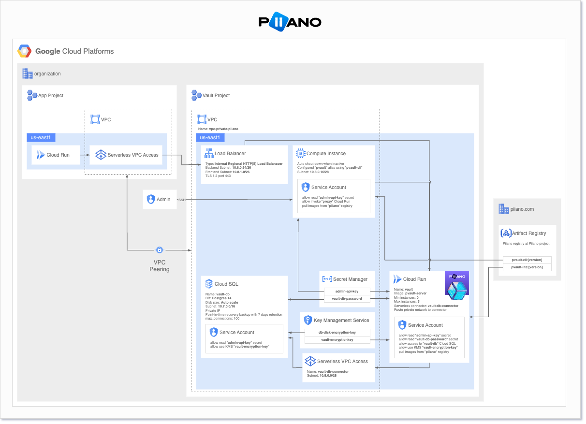

# Piiano vault deployment on GCP

The deployment of Piiano Vault on GCP will deploy the application. 

Resources to be deployed are:
- Cloud SQL: application database.
- Cloud Run: vault server.
- Network: VPCs, Serverless/SQL connection, subnets.
- Artifact Registry: docker image storage.
- VM: vault CLI server.
- KMS

## Steps

`cloudresourcemanager.googleapis.com` API service must be enabled.
https://console.cloud.google.com/apis/api/cloudresourcemanager.googleapis.com/metrics

1. Login to GCP with `gcloud`
   ```bash
   gcloud auth application-default login
   ```
2. Init terraform
   ```bash
   terraform init
   ```
3. Deploy essential resources for terraform and cloud build.
   ```bash
   terraform apply
   ```
   Terraform will print a deployment plan and prompt for an approval.
   Review the plan and if all resources are approves. enter `yes` to apply the changes.


The following account services should have access grated by Piiano to read the Vault images from the Piiano registry:
```
pvault-cli@<project-id>.iam.gserviceaccount.com
service-<project-number>@serverless-robot-prod.iam.gserviceaccount.com
```

# Architecture



## Requirements

No requirements.

## Providers

| Name                                                                      | Version  |
|---------------------------------------------------------------------------|----------|
| <a name="provider_google"></a> [google](#provider\_google)                | 4.23.0   |
| <a name="provider_google-beta"></a> [google-beta](#provider\_google-beta) | 4.23.0   |

## Modules

| Name                                                                        | Source                                                | Version |
|-----------------------------------------------------------------------------|-------------------------------------------------------|---------|
| <a name="module_postgresql-db"></a> [postgresql-db](#module\_postgresql-db) | GoogleCloudPlatform/sql-db/google//modules/postgresql | n/a     |
| <a name="module_vpc"></a> [vpc](#module\_vpc)                               | terraform-google-modules/network/google               | ~> 4.0  |

## Resources

| Name                                                                                                                                                                                                                  | Type        |
|-----------------------------------------------------------------------------------------------------------------------------------------------------------------------------------------------------------------------|-------------|
| [google-beta_google_artifact_registry_repository.vault-repo](https://registry.terraform.io/providers/hashicorp/google-beta/latest/docs/resources/google_artifact_registry_repository)                                 | resource    |
| [google-beta_google_artifact_registry_repository_iam_binding.repository_reader](https://registry.terraform.io/providers/hashicorp/google-beta/latest/docs/resources/google_artifact_registry_repository_iam_binding)  | resource    |
| [google-beta_google_artifact_registry_repository_iam_binding.repository_writter](https://registry.terraform.io/providers/hashicorp/google-beta/latest/docs/resources/google_artifact_registry_repository_iam_binding) | resource    |
| [google-beta_google_cloud_run_service.pvault-server](https://registry.terraform.io/providers/hashicorp/google-beta/latest/docs/resources/google_cloud_run_service)                                                    | resource    |
| [google-beta_google_compute_global_address.private_ip_address](https://registry.terraform.io/providers/hashicorp/google-beta/latest/docs/resources/google_compute_global_address)                                     | resource    |
| [google-beta_google_project_service.vpcaccess_api](https://registry.terraform.io/providers/hashicorp/google-beta/latest/docs/resources/google_project_service)                                                        | resource    |
| [google-beta_google_project_service_identity.gcp_sa_artifact_registry](https://registry.terraform.io/providers/hashicorp/google-beta/latest/docs/resources/google_project_service_identity)                           | resource    |
| [google-beta_google_project_service_identity.gcp_sa_cloud_run](https://registry.terraform.io/providers/hashicorp/google-beta/latest/docs/resources/google_project_service_identity)                                   | resource    |
| [google-beta_google_project_service_identity.gcp_sa_cloud_sql](https://registry.terraform.io/providers/hashicorp/google-beta/latest/docs/resources/google_project_service_identity)                                   | resource    |
| [google-beta_google_service_networking_connection.private_vpc_connection](https://registry.terraform.io/providers/hashicorp/google-beta/latest/docs/resources/google_service_networking_connection)                   | resource    |
| [google-beta_google_vpc_access_connector.connector_vault_cloud_run](https://registry.terraform.io/providers/hashicorp/google-beta/latest/docs/resources/google_vpc_access_connector)                                  | resource    |
| [google_cloud_run_service_iam_policy.noauth](https://registry.terraform.io/providers/hashicorp/google/latest/docs/resources/cloud_run_service_iam_policy)                                                             | resource    |
| [google_kms_crypto_key.key](https://registry.terraform.io/providers/hashicorp/google/latest/docs/resources/kms_crypto_key)                                                                                            | resource    |
| [google_kms_crypto_key_iam_member.crypto_key_cloud_run](https://registry.terraform.io/providers/hashicorp/google/latest/docs/resources/kms_crypto_key_iam_member)                                                     | resource    |
| [google_kms_crypto_key_iam_member.crypto_key_db](https://registry.terraform.io/providers/hashicorp/google/latest/docs/resources/kms_crypto_key_iam_member)                                                            | resource    |
| [google_kms_crypto_key_iam_member.crypto_key_registry](https://registry.terraform.io/providers/hashicorp/google/latest/docs/resources/kms_crypto_key_iam_member)                                                      | resource    |
| [google_kms_key_ring.keyring](https://registry.terraform.io/providers/hashicorp/google/latest/docs/resources/kms_key_ring)                                                                                            | resource    |
| [google_project_iam_member.pvault_sql_client](https://registry.terraform.io/providers/hashicorp/google/latest/docs/resources/project_iam_member)                                                                      | resource    |
| [google_project_service.apis](https://registry.terraform.io/providers/hashicorp/google/latest/docs/resources/project_service)                                                                                         | resource    |
| [google_secret_manager_secret.db-pass](https://registry.terraform.io/providers/hashicorp/google/latest/docs/resources/secret_manager_secret)                                                                          | resource    |
| [google_secret_manager_secret_version.db-pass](https://registry.terraform.io/providers/hashicorp/google/latest/docs/resources/secret_manager_secret_version)                                                          | resource    |
| [google_service_account.pvault-server-sa](https://registry.terraform.io/providers/hashicorp/google/latest/docs/resources/service_account)                                                                             | resource    |
| [google_service_account.sa_vault_repository_push](https://registry.terraform.io/providers/hashicorp/google/latest/docs/resources/service_account)                                                                     | resource    |
| [google_iam_policy.noauth](https://registry.terraform.io/providers/hashicorp/google/latest/docs/data-sources/iam_policy)                                                                                              | data source |

## Inputs

| Name                                                                                                                                          | Description                                                                                                                                                    | Type                | Default                                                                                                                                                                                                                                                                                                                                                                                                                                                                                                                       | Required |
|-----------------------------------------------------------------------------------------------------------------------------------------------|----------------------------------------------------------------------------------------------------------------------------------------------------------------|---------------------|-------------------------------------------------------------------------------------------------------------------------------------------------------------------------------------------------------------------------------------------------------------------------------------------------------------------------------------------------------------------------------------------------------------------------------------------------------------------------------------------------------------------------------|:--------:|
| <a name="input_apis"></a> [apis](#input\_apis)                                                                                                | List of APIs                                                                                                                                                   | `list(string)`      | <pre>[<br>  "sqladmin.googleapis.com",<br>  "serviceusage.googleapis.com",<br>  "compute.googleapis.com",<br>  "run.googleapis.com",<br>  "vpcaccess.googleapis.com",<br>  "artifactregistry.googleapis.com",<br>  "deploymentmanager.googleapis.com",<br>  "servicenetworking.googleapis.com",<br>  "networkmanagement.googleapis.com",<br>  "sql-component.googleapis.com",<br>  "secretmanager.googleapis.com",<br>  "iamcredentials.googleapis.com",<br>  "iam.googleapis.com",<br>  "cloudkms.googleapis.com"<br>]</pre> |    no    |
| <a name="input_connector_cloud_run_max_instances"></a> [connector\_cloud\_run\_max\_instances](#input\_connector\_cloud\_run\_max\_instances) | Maximum number of instances used by VPC Serverless connector                                                                                                   | `number`            | `4`                                                                                                                                                                                                                                                                                                                                                                                                                                                                                                                           |    no    |
| <a name="input_connector_cloud_run_range"></a> [connector\_cloud\_run\_range](#input\_connector\_cloud\_run\_range)                           | Cloud Run connector IP range (used to connect Cloud Run to VPC)                                                                                                | `string`            | `"10.8.0.0/28"`                                                                                                                                                                                                                                                                                                                                                                                                                                                                                                               |    no    |
| <a name="input_db_instance_ip_range"></a> [db\_instance\_ip\_range](#input\_db\_instance\_ip\_range)                                          | Database instance IP range                                                                                                                                     | `string`            | `"10.237.0.0/16"`                                                                                                                                                                                                                                                                                                                                                                                                                                                                                                             |    no    |
| <a name="input_db_instance_name"></a> [db\_instance\_name](#input\_db\_instance\_name)                                                        | Database instance name                                                                                                                                         | `string`            | `"sql-pvault-uc1"`                                                                                                                                                                                                                                                                                                                                                                                                                                                                                                            |    no    |
| <a name="input_db_name"></a> [db\_name](#input\_db\_name)                                                                                     | Vault database name                                                                                                                                            | `string`            | `"pvault"`                                                                                                                                                                                                                                                                                                                                                                                                                                                                                                                    |    no    |
| <a name="input_db_pass"></a> [db\_pass](#input\_db\_pass)                                                                                     | Vault database pass                                                                                                                                            | `string`            | n/a                                                                                                                                                                                                                                                                                                                                                                                                                                                                                                                           |   yes    |
| <a name="input_db_tier"></a> [db\_tier](#input\_db\_tier)                                                                                     | Database instance tier                                                                                                                                         | `string`            | `"db-f1-micro"`                                                                                                                                                                                                                                                                                                                                                                                                                                                                                                               |    no    |
| <a name="input_db_user"></a> [db\_user](#input\_db\_user)                                                                                     | Vault database user                                                                                                                                            | `string`            | `"pvault"`                                                                                                                                                                                                                                                                                                                                                                                                                                                                                                                    |    no    |
| <a name="input_db_version"></a> [db\_version](#input\_db\_version)                                                                            | Postgres database version                                                                                                                                      | `string`            | `"POSTGRES_13"`                                                                                                                                                                                                                                                                                                                                                                                                                                                                                                               |    no    |
| <a name="input_db_zone"></a> [db\_zone](#input\_db\_zone)                                                                                     | Database zone                                                                                                                                                  | `string`            | `"us-central1-c"`                                                                                                                                                                                                                                                                                                                                                                                                                                                                                                             |    no    |
| <a name="input_firewall"></a> [firewall](#input\_firewall)                                                                                    | List of firewalls being created                                                                                                                                | `any`               | <pre>[<br>  {<br>    "allow": [<br>      {<br>        "ports": [<br>          "22"<br>        ],<br>        "protocol": "tcp"<br>      }<br>    ],<br>    "direction": "INGRESS",<br>    "name": "fw-allow-ssh-ingress-vpc-private-piiano",<br>    "ranges": [<br>      "0.0.0.0/0"<br>    ]<br>  }<br>]</pre>                                                                                                                                                                                                                |    no    |
| <a name="input_image"></a> [image](#input\_image)                                                                                             | Vault server image name                                                                                                                                        | `string`            | `"us-central1-docker.pkg.dev/ops-main/piiano/pvault-server:0.5.5"`                                                                                                                                                                                                                                                                                                                                                                                                                                                            |    no    |
| <a name="input_kms_key_name"></a> [kms\_key\_name](#input\_kms\_key\_name)                                                                    | KMS key name                                                                                                                                                   | `string`            | `"pvault"`                                                                                                                                                                                                                                                                                                                                                                                                                                                                                                                    |    no    |
| <a name="input_kms_ring_name"></a> [kms\_ring\_name](#input\_kms\_ring\_name)                                                                 | KMS Ring name                                                                                                                                                  | `string`            | `"pvault"`                                                                                                                                                                                                                                                                                                                                                                                                                                                                                                                    |    no    |
| <a name="input_network"></a> [network](#input\_network)                                                                                       | VPC Network name                                                                                                                                               | `string`            | `"vpc-private-piiano"`                                                                                                                                                                                                                                                                                                                                                                                                                                                                                                        |    no    |
| <a name="input_project"></a> [project](#input\_project)                                                                                       | GCP Project ID where resources will be deployed                                                                                                                | `string`            | `"ops-main"`                                                                                                                                                                                                                                                                                                                                                                                                                                                                                                                  |    no    |
| <a name="input_region"></a> [region](#input\_region)                                                                                          | Region where resources will be deployed                                                                                                                        | `string`            | `"us-central1"`                                                                                                                                                                                                                                                                                                                                                                                                                                                                                                               |    no    |
| <a name="input_repository_readers"></a> [repository\_readers](#input\_repository\_readers)                                                    | List of user/groups/Service Account with permissions to pull vault registry images<br>    Example: [user:{emailid}, serviceAccount:{emailid}, group:{emailid}] | `list(any)`         | `[]`                                                                                                                                                                                                                                                                                                                                                                                                                                                                                                                          |    no    |
| <a name="input_repository_writters"></a> [repository\_writters](#input\_repository\_writters)                                                 | List of user/groups/Service Account with permissions to push vault registry images<br>    Example: [user:{emailid}, serviceAccount:{emailid}, group:{emailid}] | `list(any)`         | `[]`                                                                                                                                                                                                                                                                                                                                                                                                                                                                                                                          |    no    |
| <a name="input_routes"></a> [routes](#input\_routes)                                                                                          | List of routes being created                                                                                                                                   | `list(map(string))` | <pre>[<br>  {<br>    "description": "route through IGW to access internet",<br>    "destination_range": "0.0.0.0/0",<br>    "name": "rt-egress-internet",<br>    "next_hop_internet": "true"<br>  }<br>]</pre>                                                                                                                                                                                                                                                                                                                |    no    |
| <a name="input_subnets"></a> [subnets](#input\_subnets)                                                                                       | List of subnets being created                                                                                                                                  | `list(map(string))` | <pre>[<br>  {<br>    "description": "Authorized subnet for accessing Vault Cloud Run",<br>    "subnet_ip": "10.0.0.0/24",<br>    "subnet_name": "sb-vault-authorized-uc1",<br>    "subnet_private_access": "true",<br>    "subnet_region": "us-central1"<br>  }<br>]</pre>                                                                                                                                                                                                                                                    |    no    |

## Outputs

No outputs.
